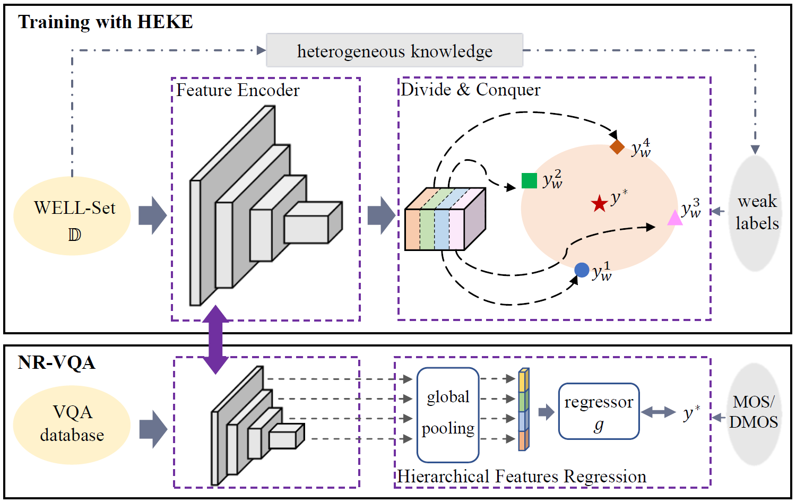

# BVQA-HEKE

Source codes for "No-Reference Video Quality Assessment with Heterogeneous Knowledge Ensemble" accepted by ACM-MM 2021, and the extension of this work "Spatiotemporal Representation Learning for Blind Video Quality Assessment" is published in IEEE-TCSVT.



---------------------

Pretrained encoders, VQA features, and codes are available now.

-----------------------

### NOTE

Our dataloading relies on a dataset_info file named `xxx_list_for_VQA.txt`, which contains the information of the dataset. In folder `./dataset_info/`, we provide the files of the datasets. You can revise the code to suit your dataloading settings properly.

### Pretrained model

We provide the pretrained models: HEKE$_c^4$-r2p1d and HEKE$_c^4$-resnet. 

Download the pretrained models from [GoogleDrive](https://drive.google.com/drive/folders/1NzTdDEafcGcHQrMxzc2qAmwWmL9Pk0Xx?usp=sharing) or [百度云](https://pan.baidu.com/s/1ej1snlAM4n1gdMm0AP7AmA), 提取码：2qxh

Put the pretrained models in the folder `./pretrained`, and you can use the model to verify the performance.

If you are interested in other pretrained models in our paper (e.g., HEKE$_c^1$-r2p1d, HEKE$_c^2$-r2p1d, and HEKE$_c^1$-resnet), please contact me for sharing.

### PreExtracted features

The VQA features of six synthetic datasets (i.e., LIVE, CSIQ, IVPL, IVC-IC, EPFL-PoliMI, and LIVE-Mobile) are provided. Download the preextracted features from [GoogleDrive](https://drive.google.com/drive/folders/1XArB2E2qd4P0OLBKP0qDck5Ioq66nPAH?usp=sharing) or [百度云](https://pan.baidu.com/s/1OsgYJs5Pi7WZfxhk6M_qrg), 提取码：932a

Put the features in the folder `./data`, and you can use the features for intra-/inter-dataset performance verification. 

Currently we only upload the features from r2p1d_HEKE_4. If you need other features, please feel free to contact me.

### Performance validation on synthetic datasets

When the pretrained models are put in the folder `./pretrained`, you can 

- (1) extract features with `demo_extract_features.py`. This file also results in completely blind VQA performance. 
`python3 -u demo_extract_features.py --database LIVE --model r2p1d_HEKE_4 --load ./pretrained/r2p1d_model_HEKE4.pkl --save ./data/r2p1d_HEKE_4`

Or your can also use the provided preextracted features directly. 

- (2) finetune the regressor with `demo_finetune_VQA.py` to get the intra-dataset performance on synthetic datasets.
`python3 -u demo_finetune_VQA.py --base_path PATH_TO_DATASET --database LIVE --load PATH_TO_FEATURE --epoch 300 --lr 1e-4 --batch_size BATCH_SIZE --seed 12318 --f1 --f2 --f3 --f4 --fave --fmax --fstd`

- (3) conduct inter-dataset / cross-database experiment by 'demo_crossDB_VQA.py`. Command is simiar and please check in the file.
 
If you are interested in other pretrained models in our paper (e.g., HEKE$_c^1$-r2p1d, HEKE$_c^2$-r2p1d, and HEKE$_c^1$-resnet), please contact me for sharing.

### Performance validation on authentic datasets

Similarly, you should first extract features with the pretrained model via `demo_extract_features_authentic.py`.

We use the code from [bench_mark](https://github.com/vztu/BVQA_Benchmark) to verify the effectiveness of the extracted features on UGC databases.


### WELL-Set 

The WELL-Set is sourced from internet videos, so we cannot directly release the dataset considering the copyright.

One can use the guidance to download, process and generate the dataset for your purpose. More details are in the folder `./WELL-Set`.

### Pretraining

Our encoders are pretrained on WELL-Set. Once the pretraining is done, the encoder is fixed for all the validation. The pretraining requires WELL-Set or other large-scale datasets with weak labels. 

`demo_train_baseline.py` and `demo_train_baseline_resnet_RGB_diff.py` provide the source codes for pretraining. 

#### some details

- In our implementation, the videos in WELL-Set are stored as images with down-sampling ($768 \times 432$) -> $384 \times 216$).
- The input size of our encoder `r2p1d_HEKE_4` is `[batch, 3, 8, 216, 384]` where 8 is the number of frames, and that of `resnet_HEKE_4` is `[batch, 3, 216, 384]`.
- Actually only four segments (each contains 8 consecutive frames) are stored for each video sample. The argument `--dynamic` means if we select the segment randomly or not.
- We are encouraging you use multiple GPUs to enable a bigger batch_size. But considering the limitation, we only use `batch_size=8`.
- We adopt `LIVE` video dataset as the validation set to monitor the training.

### Environment
```
Python 3.6.5
scipy 1.1.0
numpy 1.14.3
PyTorch 1.1.0
```
Different versions may occur slight changes in performance.

### Cite
If you are interested in the work, or find the code helpful, please cite our work
```
@ARTICLE{heke-csvt,
  author={Liu, Yongxu and Wu, Jinjian and Li, Leida and Dong, Weisheng and Zhang, Jinpeng and Shi, Guangming},
  journal={IEEE Transactions on Circuits and Systems for Video Technology}, 
  title={Spatiotemporal Representation Learning for Blind Video Quality Assessment}, 
  year={2021},
  volume={},
  number={},
  pages={},
  doi={10.1109/TCSVT.2021.3114509}}
```

### Contact

If any question or bug, feel free to contact me via `yongxu.liu@stu.xidian.edu.cn`.
